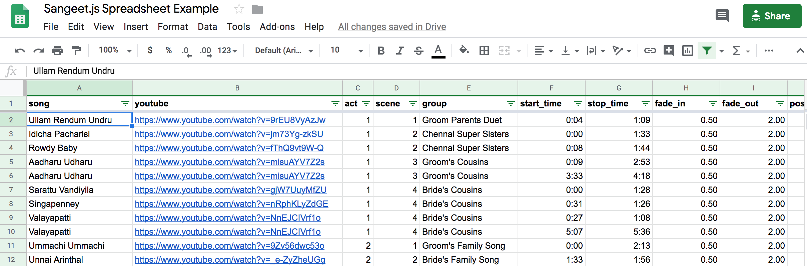
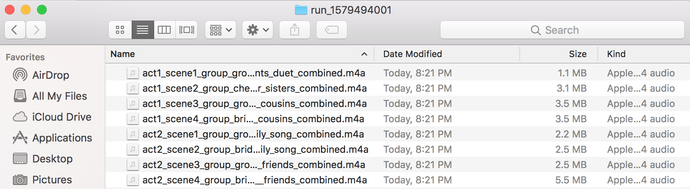

# Welcome to Sangeet.js 👋
[](#)


> Automatically generate mixtapes for your sangeet songs

## About
Solves the painstaking task of ripping, concatenating, and mixing songs from Youtube.

1. Takes in a spreadsheet with all the songs, with their start and stop times along with how you want them faded in and
out.
2. All songs under the same act and scene will be combined into a single song.
3. Will download from youtube, extract out the best possible audio quality and will trim, fade in/out, concatenate and
rename the songs accordingly.

Under the hood it primarily devolves to `youtube-dl` and `ffmpeg` for all the heavy-lifting. `sangeet.js` takes a
batteries-included, sane-defaults, best quality (ymmv) approach to dealing with the crazy number of codecs that youtube
runs.
In the process, I ended up learning a lot about ffmpeg (amazing tool!) and life.

> Given this 


> get this


## Features
1. Idempotent® - Each run will create a separate folder so your songs won't get mixed up.
2. Intelligence Caching® - Each run will only download unseen Youtube songs.
3. Impress your
bride/groom/in-laws/cousins/uncles/aunts/grandmas/grandpas/great-great-uncle/cousin-third-removed's-grandparents with
realtime audio mixtape generation

## Disclaimer
1. This was hacked together over a Sunday to bring some order and sanity into the house and our lives. 
2. Code is written exactly how a recovering perl hacker now business guy would write in node.js. Caveat emptor.
3. Only tested on a Mac (don't see any reason why it won't work on linux. Windows I have no clue)

## Requirements

1. `youtube-dl` (`brew install youtube-dl`)

2. `ffmpeg` (`brew install ffmpeg`)

## Install

```sh
npm install
```

## Usage

Clone this spreadsheet:
https://docs.google.com/spreadsheets/d/1CM-PR-QzbHH8hFtqQuNrBGXUhL30l1G8rxtxPedhqic/edit?usp=sharing

Export this spreadsheet as csv to the folder of `sangeet.js`

```sh
node sangeet.js NAME_OF_SPREADSHEET.csv
```

## Author

👤 **Sivamani Varun**

* Github: [@netvarun](https://github.com/netvarun)

## Show your support

Give a ⭐️ if this project helped you!


***
_This README was generated with ❤️ by [readme-md-generator](https://github.com/kefranabg/readme-md-generator)_
